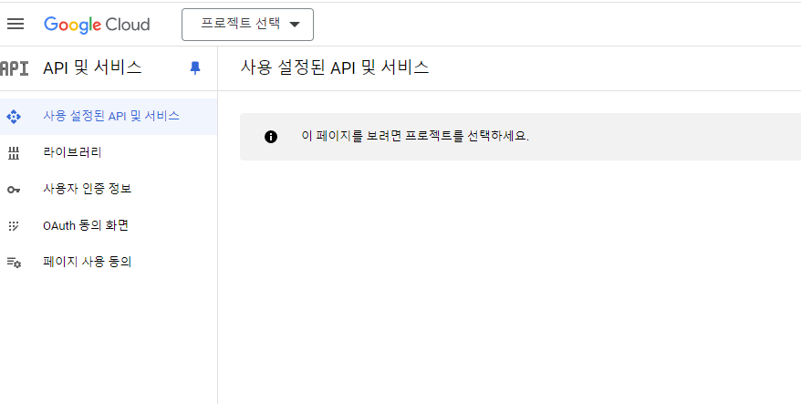

# EarBee


## 목차
   1. [프로젝트 목적](#프로젝트-목적)
   2. [사용 기술](#사용-기술)
   3. [수행 도구](#수행-도구)
   4. [설계](#설계)
   5. [기능](#기능)
   6. [테스트](#테스트)
   7. [서버](#서버)
   8. [Properties](#Properties)
   9. [학습](#학습) 

# 프로젝트 목적

<br>

# 사용 기술


### BackEnd
    
### FrontEnd
    
    
### API
- 국세청_사업자등록정보 진위확인 및 상태조회 서비스
    
### Server

<br>

# 수행 도구

<br>

# 설계

<br>    

# 기능

<br>

# 테스트

<details>
    <summary>자세히</summary>

1. restAPI test (확인 완료)
    
</details>

<br>

# 서버

<br>

# Properties

```
# dbms
spring.datasource.url=jdbc:oracle:thin:@localhost:1521:XE
spring.datasource.driver-class-name=oracle.jdbc.OracleDriver
spring.datasource.username="earbee"
spring.datasource.password="root"

# jsp
spring.mvc.view.prefix=/WEB-INF/views/
spring.mvc.view.suffix=.jsp


# Server port 고정
server.port= 8080

# jsp 변경되면 자동으로 업데이트 지정
server.servlet.jsp.init-parameters.development = true 

```


# 학습
<details>
    <summary>자세히</summary>
1. JSP    
spring boot에서는 jsp를 사용하기 위해서는 추가적으로 의존성 주입이 필요하다.

#### build.gradle
```
// 내장 톰켓에서 jsp인식할 수 있도록 jsp 의존성 삽입
implementation 'org.apache.tomcat.embed:tomcat-embed-jasper'
// jstl 의존성 삽입
implementation 'javax.servlet:jstl:1.2'
```

<br>

#### application.properties

```
// view 접두사 ( 경로 설정 )
spring.mvc.view.prefix=/WEB-INF/views/

// view 접미사 ( 확장자 설정)
spring.mvc.view.suffix=.jsp
```

<br>

spl
```sql
select * from user_tab_comments;
SELECT 'DROP TABLE "' || TABLE_NAME || '" CASCADE CONSTRAINTS;' FROM user_tables;

-- 이미지 1
create table img(
    img_seq Number primary key,
    img_name VARCHAR2(100) NOT NULL,
    img_origin_name VARCHAR2(100) NOT NULL,
    img_size Number NOT NULL,
    img_type VARCHAR2(10) NOT NULL,
    representative VARCHAR2(5) CHECK(representative IN('false','true'))
);

-- ex 
insert into img values(1,'이름','진짜 이름',1,1,'false');
select * from img;


-- 위치 2
create table path(
    path_seq Number PRIMARY KEY,
    location_x Number NOT NULL,
    location_y Number NOT NULL,
    location_z Number NOT NULL
);

-- ex
insert into path values(0,1,2,3);
select * from path;

-- 유저 3
create table userinfo(
    user_seq NUMBER PRIMARY KEY,
    user_id VARCHAR2(15) NOT NULL,
    user_pwd VARCHAR2(100) NOT NULL,
    user_name VARCHAR2(20) NOT NULL,
    user_rrn VARCHAR2(100) NOT NULL,
    user_phone VARCHAR2(15) NOT NULL UNIQUE,
    user_eamil VARCHAR2(30) NOT NULL UNIQUE,
    user_address VARCHAR2(50),
    user_role VARCHAR2(10) NOT NULL,
    img_seq NUMBER
);
-- ex 
insert into userinfo values (1, 'seoin' , '123qwe' , '박서인' , '951223-1', '010-2523-2356','seoin2389@icloud.com','매곡동','admin',1);
insert into userinfo values (2, 'ywy' , '123qwe' , '윤원용' , '951223-1', '010-2asdasd','asdasdasd','매곡동','admin',null);
select * from userinfo;

-- 문의 4
create table inquiry(
    inq_seq Number primary key,
    title VARCHAR2(100) NOT NULL,
    content VARCHAR2(500) NOT NULL,
    send_date DATE NOT NULL,
    img_seq Number,
    constraint inq_img_seq FOREIGN key(img_seq) references img(img_seq)
);
insert into inquiry values(2,'첫 문의','안녕하세요',sysdate,null );
select * from inquiry;

-- 노래방 5
create table karaoke(
    karaoke_seq number primary key,
    karaoke_name VARCHAR2(50) NOT NULL,
    path_seq NUMBER,
    user_seq Number,
    karaoke_intro VARCHAR2(150),
    karaoke_phone VARCHAR2(20),
    img_seq NUMBER NOT NULL,
    admin_approval VARCHAR2(5)CHECK(admin_approval IN('false','true')),
    constraint karaoke_path_seq FOREIGN KEY(path_seq) references path(path_seq) on delete cascade,
    constraint karaoke_user_seq FOREIGN KEY(user_seq) references userinfo(user_seq)on delete cascade,
    constraint karaoke_img_seq FOREIGN key(img_seq) references img(img_seq)
);

insert into karaoke values(1,'첫 노래방', 0, 1, '노래방 개점','010-1111-1111',1, 'false');
select * from karaoke;

-- 즐겨찾기 6
create table favorit(
    favorit_seq NUMBER PRIMARY KEY,
    user_seq NUMBER NOT NULL,
    karaoke_seq NUMBER NOT NULL,
    alias VARCHAR2(20) NOT NULL,
    constraint favorit_user_seq foreign key(user_seq) references userinfo(user_seq) on delete cascade,
    constraint favorit_karaoke_seq foreign key(karaoke_seq) references karaoke(karaoke_seq) on delete cascade
);

insert into favorit values(1, 1, 1, '단골입니다');
select * from favorit;

--리뷰 7
CREATE TABLE review(
    review_seq Number PRIMARY KEY,
    title Varchar2(50) NOT NULL,
    content VARCHAR2(500) not null,
    create_date Date NOT NULL,
    update_date Date NOT NULL,
    img_seq Number,
    review_views Number NOT NULL,
    review_recommends Number NOT NULL,
    declearation Number NOT NULL,
    user_seq Number NOT NULL,
    karaoke_seq Number NOT NULL,
    CONSTRAINT review_user_seq FOREIGN key(user_seq) REFERENCES userinfo (user_seq) on delete cascade,
    CONSTRAINT review_karaoke_seq FOREIGN key(karaoke_seq) REFERENCES Karaoke(Karaoke_seq)on delete cascade 
);

insert into review values(1,'첫 리뷰','첫 리뷰입니다', sysdate, sysdate,null,0,0,0,1,1 );
select * from review;

--댓글 8
create table review_comment(
    cm_seq Number  PRIMARY KEY,
    cm_group Number NOT NULL,
    cm_Num Number NOT NULL,
    title Varchar2(50) NOT NULL,
    content Varchar2(150) NOT NULL,
    create_date Date NOT NULL,
    update_date Date NOT NULL,
    review_recommends Number NOT NULL,
    declearation Number NOT NULL,
    user_seq Number NOT NULL,
    review_seq Number NOT NULL,
    img_seq Number,
    CONSTRAINT comment_user_seq FOREIGN key(user_seq) REFERENCES userinfo(user_seq) on delete cascade,
    CONSTRAINT comment_review_seq foreign key(review_seq) REFERENCES review(review_seq) on delete cascade,
    CONSTRAINT comment_img_seq FOREIGN key(img_seq) REFERENCES img(img_seq)
);

insert into review_comment values(1,1,1,'안녕','첫 댓글',sysdate,sysdate,0,0,1,1,null );
select * from review_comment;


--방정보 9
CREATE TABLE Room(
    room_seq Number NOT NULL PRIMARY KEY,
    room_size Number NOT NULL,
    price_Number Number NOT NULL,
    Room_num Number NOT NULL,
    karaoke_seq Number NOT NULL,
    img_seq Number NOT NULL,
    CONSTRAINT fk_img_seq FOREIGN key(img_seq) REFERENCES img(img_seq),
    CONSTRAINT fk_karaoke_seq FOREIGN key(karaoke_seq) REFERENCES karaoke(karaoke_seq) on delete cascade
);
insert into room values(0,5,3000,13,1,1);
select * from room;


--쪽지함 10
CREATE TABLE Message(
    msg_seq Number NOT NULL PRIMARY KEY,
    title Varchar2(50) NOT NULL,
    msg_content Varchar2(500) NOT NULL,
    msg_date Date NOT NULL,
    delete_by_sender varchar2(5) NOT NULL CHECK(delete_by_sender IN('false','true')),
    delete_by_recever varchar2(5) NOT NULL CHECK(delete_by_recever IN('false','true')),
    send_User Number NOT NULL,
    recever_User Number NOT NULL,
    CONSTRAINT fk_send_User FOREIGN key(send_User) REFERENCES Userinfo (user_seq) on delete cascade,
    CONSTRAINT fk_recever_User FOREIGN key(recever_User) REFERENCES Userinfo (user_seq) on delete cascade
);
drop table message;
insert into message values(1,'쪽지','쪽지입니다',sysdate,'false','false',1,2);
select * from message;


--예약 11
CREATE TABLE reservation(
    rev_seq Number NOT NULL PRIMARY KEY,
    rev_time Date NOT NULL,
    rev_approved Varchar2(5) NOT NULL CHECK(rev_approved IN('false','true')),
    user_seq Number NOT NULL,
    room_seq Number NOT NULL,
    CONSTRAINT reservation_user_seq FOREIGN key(user_seq) REFERENCES userinfo(user_seq) on delete cascade,
    CONSTRAINT reservation_Room_seq FOREIGN key(room_seq) REFERENCES room(room_Seq) on delete cascade
);

insert into reservation values(1, sysdate,'false',1,0);
select* from reservation;

```


</details>


